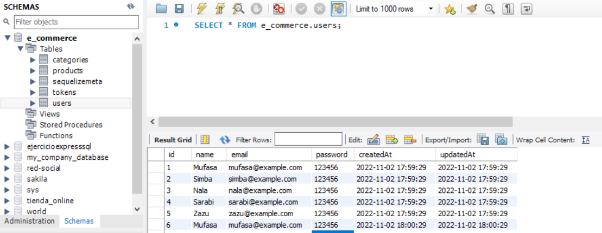

# Proyecto Backend 1º 🤝

El siguiente proyecto colaborativo consiste en la creación de una tienda online (e-commerce) en la que se combinan los conocimientos adquiridos en las tecnologías Node y Express, además de MySQl y Sequelize.

## Descripción y desarrollo del proyecto 🔧

Para este proyecto hemos realizado un diagrama creando diferentes tablas y la relación entre ellas (1:1, 1:N, N:M).
Tamién, se ha tenido que desarrollar una API REST capaz de los siguientes puntos:

- Registro de usuarios usando Bcrypt.
- Login de usuarios + token + middleware.
- Crear un CRUD.
- Al menos una relación Many to Many y otra One to Many.
- Utilización de seeders.

Para trabajar de manera colaborativa, uno de los requisitos imprescindibles del proyecto ha sido el uso de ramas con git (personal, develop y main).

## Tecnologías utilizadas 💻

Para este proyecto hemos utilizado las tecnologías Node, Express, MySQL y Sequelize, y la plataforma API Postman.

### Preview 

- Vista general de Postman

- Vista general de MySQL

----

Hecho por [Sif Et Tabaa](https://github.com/Sif03) y [Miguel Herrera](https://github.com/miguelherreravillanueva)
