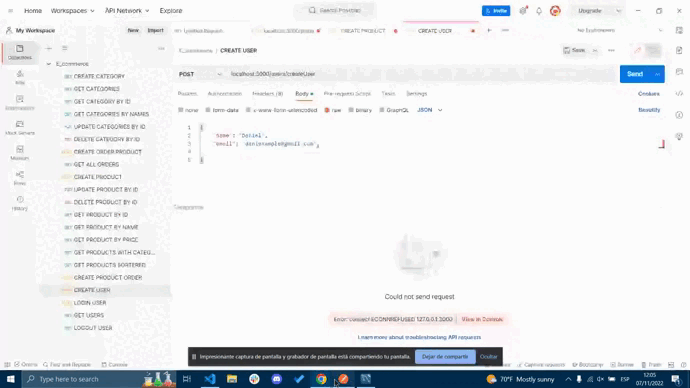
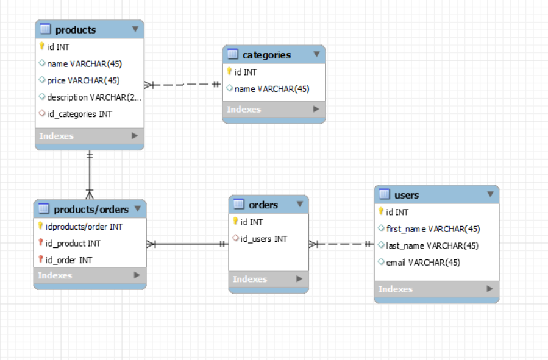

# Backend 1st Project 🤝

The following collaborative project consists on the creation of an online store (e-commerce) in which the knowledge acquired in Node and Express technologies is combined, in addition to MySQl and Sequelize.

## Description and development of the project 🔧

For this project we have made a diagram creating different tables and the relationship between them (1:1, 1:N, N:M).
Also, it has been needed to develop a REST API capable of the following points:

- User registration using Bcrypt.
- User login + token + middleware.
- Creation of a CRUD.
- At least one Many to Many relationship and another One to Many.
- Use of seeders.

To work collaboratively, one of the essential requirements of the project has been the use of branches on Git (personal, develop and main).

## Technologies used 💻

For this project we have used Node, Express, MySQL and Sequelize technologies, and the Postman API platform.

### Preview 

- Postman general overview
    User create endpoint.

- MySQL general overview

- SQL diagram general overview

----

Hecho por [Sif Et Tabaa](https://github.com/Sif03) y [Miguel Herrera](https://github.com/miguelherreravillanueva)
